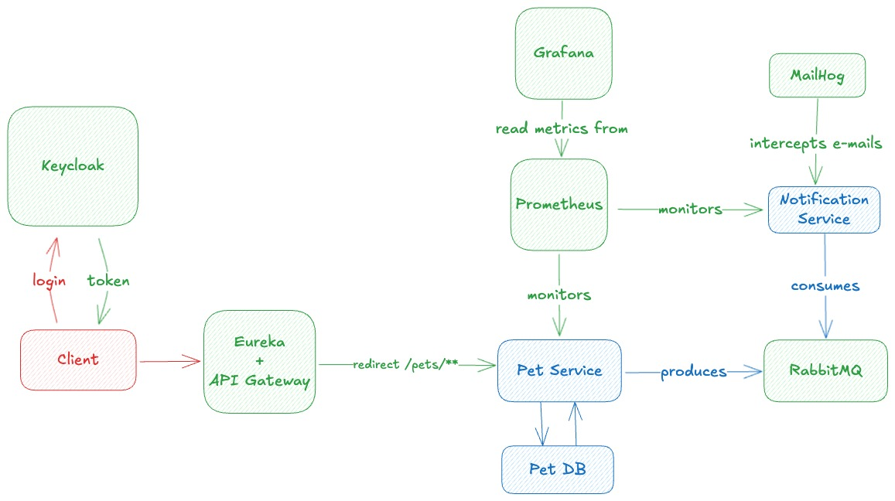
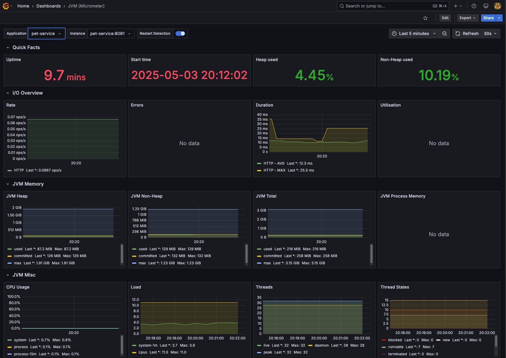

# Pet Adoption System

A microservices-based system for managing pet adoptions, built with Spring Boot and Spring Cloud. The project uses
Keycloak for identity management, RabbitMQ for async messaging, Redis for caching, and is fully containerized with
Docker Compose.

## Architecture




### Eureka Server (port 8761)

Service discovery server. All microservices register themselves and discover each other dynamically through Eureka,
enabling load-balanced communication without hardcoded URLs.

### API Gateway (port 80)

Single entry point for all client requests. Routes traffic to downstream services via Eureka and provides:

* JWT validation — rejects invalid/expired tokens before they reach downstream services
* Rate limiting — Redis-based token bucket algorithm (10 req/s sustained, 20 burst)
* Circuit breaker — Resilience4j with fallback response when downstream services are unavailable
* CORS — configured for cross-origin requests

### Keycloak (port 8080)

Centralized identity and access management:

* Realm: `animal-adoption` with OAuth 2.0 / OpenID Connect
* Backend client (`animal-adoption`) with roles: `REGISTER_PET`, `UPDATE_PET`, `DELETE_PET`, `ADMIN`
* Frontend client (`frontend`) with Authorization Code + PKCE flow
* Google identity provider with automatic account linking
* JWT tokens used by all services for authentication and authorization

### Pet Service (port 8081)

Core service for managing pets and adoptions:

* CRUD operations with role-based access control (`@PreAuthorize`)
* Adoption flow: updates pet status, assigns owner, publishes event to RabbitMQ
* Publishes events to RabbitMQ on pet registration and deletion (admin notifications)
* Optimistic locking (`@Version`) to prevent race conditions on adoption
* Pet image upload via S3-compatible storage (MinIO) with public bucket
* Redis caching on featured pets with 1h TTL
* Pagination and filtering with JPA Specifications (by species, gender, size, status)
* Accent-insensitive search by name using PostgreSQL `unaccent` extension
* Flyway for database migrations
* Response DTOs to avoid exposing JPA entities

### Notification Service (port 8082)

Event-driven service for email notifications:

* Consumes events from 3 RabbitMQ queues:
    * `pet.adopted.notification` — sends adoption confirmation email to the adopter
    * `pet.registered.notification` — sends notification email to admins when a new pet is registered
    * `pet.deleted.notification` — sends notification email to admins when a pet is deleted
* Sends styled HTML emails using Thymeleaf templates
* Retry mechanism (3 attempts with exponential backoff) + Dead Letter Queue per queue
* DLQ retry endpoint (`POST /dlq/retry?queue={queueName}`) to reprocess failed messages

### Frontend (port 3000)

Next.js application for browsing and managing pets:

* Browse and filter pets by species, gender, size, and status with pagination
* Search by name with accent-insensitive matching and debounced input
* Pet details page with adoption flow and image display
* User profile page with avatar and adoption history
* Keycloak authentication with NextAuth.js v5 (Authorization Code + PKCE)
* Google login with automatic account linking
* Admin pages for registering, editing, and deleting pets (role-based)
* Pet image upload with client-side validation (size, type)
* Server actions for secure API calls (tokens never exposed to the client)
* Zod validation on forms matching backend constraints
* Loading skeletons for all pages

### Shared Module

Common library used by pet-service and notification-service:

* `AdoptionMessage`, `PetRegisteredMessage`, `PetDeletedMessage`, and `UserDTO` — shared domain records (event contract between services)
* `JsonUtils` — JSON serialization/deserialization utility

### Monitoring

* **Prometheus** — scrapes metrics from all services via `/actuator/prometheus` every 15 seconds
* **Grafana** (port 3001) — dashboards for Spring Boot metrics, JVM performance, and service health
* **RedisInsight** (port 8001) — visual UI for monitoring Redis keys, memory, and performance

### Databases

Each service has its own dedicated database (database-per-service pattern):

* **Pet Service** — PostgreSQL (port 5433) with Flyway migrations
* **Keycloak** — PostgreSQL (port 5432) for users, roles, sessions, and tokens
* **Notification Service** — no database (purely event-driven)

## How to Run

### Prerequisites

* Docker

### Running the Project

```bash
# Copy the environment file
cp .env.example .env

# Start all infrastructure + notification-service (pet-service runs locally via IntelliJ)
docker compose up --build -d

# Or start everything including pet-service in Docker
docker compose --profile full up --build -d
```

The `full` profile includes an nginx reverse proxy with SSL. Generate the certificates before the first run:

```bash
./nginx/generate-certs.sh
```

Then access the application at `https://localhost` (the browser will warn about the self-signed certificate — click "proceed anyway").

Wait until all services are healthy, then the application is ready.

### Keycloak Setup (first time only)

The `animal-adoption` realm is automatically imported on first startup (via `keycloak/animal-adoption-realm.json`).
It includes the clients and roles pre-configured. You only need to:

1. Open `http://localhost:8080` and log in to the admin console (credentials from `.env`)
2. Create a test user in the `animal-adoption` realm and assign the desired roles

### Development Workflow

For day-to-day development, run pet-service locally via IntelliJ (with hot reload) and everything else in Docker:

1. `docker compose up -d` — starts infrastructure + notification-service
2. Run pet-service from IntelliJ (default profile uses `localhost` for all dependencies)
3. `cd frontend && npm run dev` — starts the frontend on `http://localhost:3000`
4. Access the API through the gateway at `http://localhost`

### Remote Debugging

Both services expose debug ports when running in Docker:

* Pet Service: `localhost:5005`
* Notification Service: `localhost:5006`

In IntelliJ: **Run** → **Edit Configurations** → **Remote JVM Debug** → set the host and port.

### Useful URLs

| Service       | URL                          |
|---------------|------------------------------|
| Frontend      | http://localhost:3000         |
| API Gateway   | http://localhost              |
| Pet Service   | http://localhost:8081         |
| Eureka        | http://localhost:8761         |
| Keycloak      | http://localhost:8080         |
| RabbitMQ      | http://localhost:15672        |
| MailHog       | http://localhost:8025         |
| Grafana       | http://localhost:3001         |
| MinIO Console | http://localhost:9001         |
| Prometheus    | http://localhost:9090         |
| Zipkin        | http://localhost:9411         |
| RedisInsight  | http://localhost:8001         |

💡 A preconfigured `insomnia.json` file is available in the root directory. Import it into Insomnia to test all
available routes.

## Technologies

### Core

* Java 21, Spring Boot 3.5, Spring Cloud 2025.0
* Next.js 16, React 19, Tailwind CSS v4
* Spring Cloud Gateway — routing, rate limiting, circuit breaker
* Spring Cloud Eureka — service discovery
* Spring Security + OAuth 2.0 — authentication and authorization
* Keycloak — identity and access management
* PostgreSQL + Flyway — relational database with versioned migrations
* RabbitMQ — async messaging with DLQ support
* Redis — distributed caching
* MinIO — S3-compatible object storage for pet images

### Libraries

* Spring Data JPA — database access
* Resilience4j — circuit breaker and time limiter
* Thymeleaf — HTML email templates
* Lombok — boilerplate reduction
* Micrometer — metrics exporter for Prometheus
* Jackson — JSON serialization
* Testcontainers — integration testing with real databases

### Infrastructure

* Docker Compose — container orchestration with health checks
* Prometheus + Grafana — monitoring and dashboards
* MailHog — email testing (dev)
* RedisInsight — Redis monitoring UI
