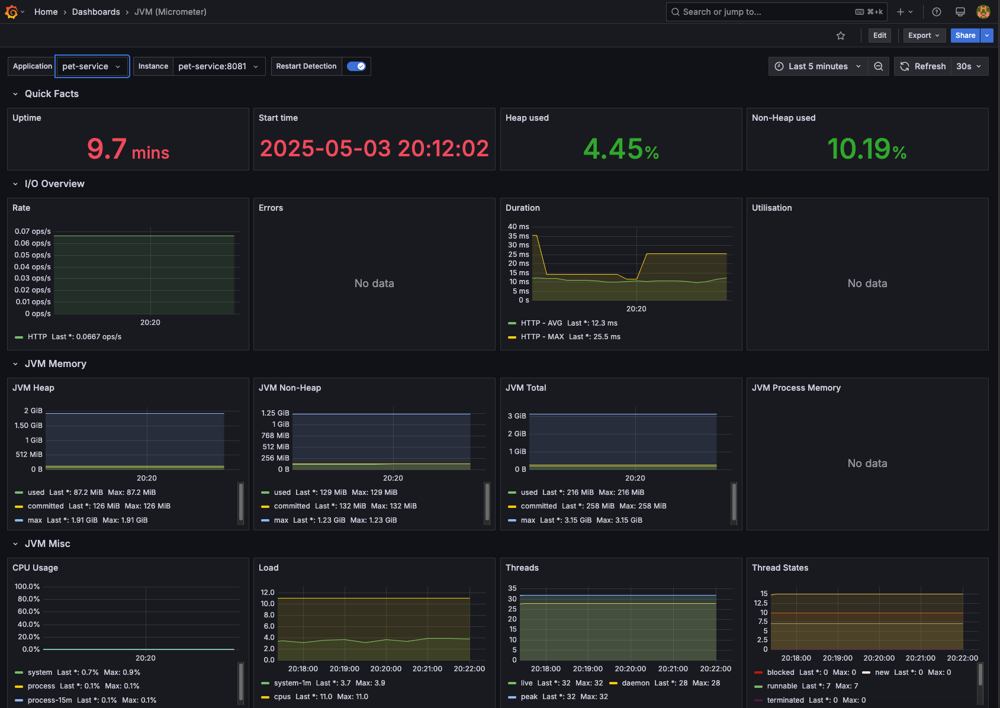

# Pet Adoption System

This project is a microservices-based architecture for managing the pet adoption system. It consists of independent services, each responsible for a specific part of the process. The system was developed using Spring Boot and utilizes Eureka, API Gateway, Prometheus, Grafana and Docker.

## Project Structure

### 1. Eureka
Eureka is used for service discovery, allowing microservices to locate and communicate with each other dynamically. The service registry is hosted at `http://localhost:8761/eureka/`.

### 2. API Gateway
The API Gateway manages incoming requests and handles JWT authentication. It validates user credentials, routes requests to the appropriate microservices (such as Pet Service and User Service), and enforces authorization on configured routes.

- **JWT Validation**: The API Gateway validates JWT tokens to ensure requests are authenticated.
- **Routing**: It directs requests to the correct microservices based on the URL path.

### 3. User Service
The User Service handles user registration and login. It validates the user's identity and issues a JWT token, which is used for authentication in other services.

### 4. Pet Service
This service is responsible for managing pets and their adoptions. The main functionalities include:

- CRUD operations for pets (create, read, update, delete).
- Adoption process: When a pet is adopted, the system updates the pet's status, assigns the owner, sets the adoption timestamp, and publishes an event to a RabbitMQ queue for further processing by other services.

### 5. Notification Service
This service is responsible for notifying users when an adoption is completed. It listens to a RabbitMQ queue for adoption events, and upon receiving a message, it sends a confirmation email to the adopter informing them that the process has been successfully finalized. 

### 6. Prometheus
Prometheus is our monitoring system that collects and stores metrics from all microservices in real-time. Key features:

- Metrics Collection: Pulls metrics from each service's /actuator/prometheus endpoint at regular intervals
- Time-Series Database: Stores all metrics with timestamps for historical analysis
- Service Health Monitoring: Tracks request rates, response times, error rates, and system resources
- Alerting: Can trigger alerts when metrics exceed predefined thresholds

All services expose Spring Boot Actuator metrics which Prometheus scrapes every 15 seconds.

### 7. Grafana

Grafana is our visualization platform that transforms Prometheus metrics into actionable insights:

- Interactive Dashboards: Provides real-time visualizations of system performance
- Service Monitoring: Displays key metrics like API response times, JVM memory usage, and database connections
- Custom Alerts: Visual indicators when metrics cross warning/critical thresholds
- Pre-built Dashboards: Includes optimized dashboards for Spring Boot applications

The Grafana instance is preconfigured with:
- A Spring Boot monitoring dashboard (ID: 4701)
- A Microservices communication map
- JVM and database performance dashboards

Accessible at http://localhost:3000 (default credentials: admin/admin)

### 8. Database
Most microservices have their own dedicated databases to ensure separation of concerns and data encapsulation:

- **Pet Service**: Maintains a database with all information related to pets and their adoption status.
- **User Service**: Contains a database with user registration and authentication details.
- **Notification Service**: This service does not require a database, as it operates solely based on messages received through RabbitMQ.

## How to Run the Project

### Prerequisites
- Docker

### Step-by-Step
1. Clone the repository and navigate to the project root.
2. Run docker compose up --build -d to start all containers.
3. Wait until all services are up and running.
4. The application is now ready to use.

⚠️ If you're using an Apple Silicon (M1/M2) or any ARM64 architecture, MailHog may fail to start. To fix it, add platform: linux/amd64 to the MailHog service in docker-compose.yml.

💡 A preconfigured insomnia.json file is available in the root directory. You can import it into Insomnia to easily test all available routes across the microservices.

## Technologies Used

### Core Technologies

- Spring Boot: Framework for developing microservices.
- Spring Cloud Gateway: Gateway for request routing and JWT validation.
- Spring Cloud Eureka: Service discovery for communication between microservices.
- PostgreSQL: Relational database for storing pet and user information.
- RabbitMQ: Message broker for handling adoption notifications.

### Monitoring & Observability

- Prometheus: Time-series database for collecting and storing metrics from all microservices.
- Grafana: Visualization platform for real-time monitoring and alerting.

### Supporting Libraries

- Spring Security: Authentication and authorization.
- JWT (JSON Web Tokens): Secure user authentication.
- Lombok: Reducing boilerplate code.
- Spring Data JPA: Database access and management.
- Micrometer: Application metrics exporter for Prometheus.